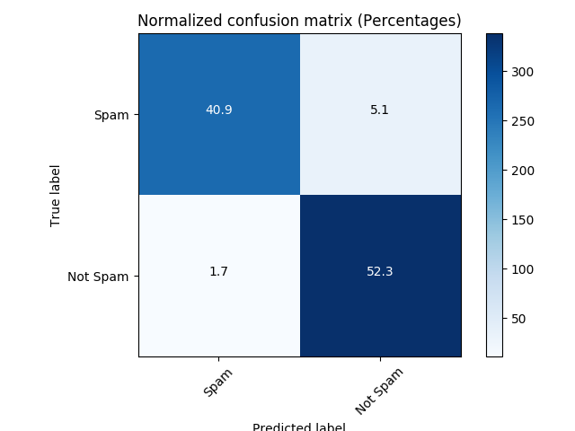

# spam-detection-comments
Algorithm for detection of spam in Youtube video comments

# How to use
## Setup
```
git clone https://github.com/nicoTrombon/spam-detection-comments.git
cd spam-detection-comments
virtualenv env
source env/bin/activate
pip install requirements.txt
```
## Train model and show some examples
```
python classifier.py
```
## Predicting on a custom comment
__on a python shell__
```
>> from classfier import *
>> your_custom_comment = 'Great video! Really enjoyed it =)'
>> clf = CommentClassifier()
>> clf.build_pipeline()
>> clf.grid_search()
>> clf.predict_example(your_custom_comment)
```


# Results

## Prediction on unseen data (withheld test-set)



## Predictions for some examples

```
**********
Example: ['z12jc1uququpzbsoq04cg15poyfsxpvoojw' 'pro stomper' '2014-11-05T15:27:34'
 'guys please subscribe me to help my channel grow please guys\xef\xbb\xbf']
Expected result: Spam
Prediction: Spam
**********
Example: ['z133ibkihkmaj3bfq22rilaxmp2yt54nb' 'Debora Favacho (Debora Sparkle)'
 '2015-05-21T14:08:41.338000' 'BEST SONG EVER X3333333333\xef\xbb\xbf']
Expected result: Not Spam
Prediction: Not Spam
**********
Example: ['z135jfhquofkjjxam04cdraphzuxxry4iso0k' 'Shaun Mac' '2014-10-26T20:10:46'
 'Also LuckyMusiqLive she probably could help u make it big because I think u  have talent. Just look her name up on the internet. Hit me up when u get  this message\xef\xbb\xbf']
Expected result: Spam
Prediction: Spam
**********
Example: ['_2viQ_Qnc6_ZYkMn1fS805Z6oy8ImeO6pSjMLAlwYfM' 'mile panika'
 '2013-11-03T14:39:42.248000'
 'I absolutely adore watching football plus I\xe2\x80\x99ve started earning income with out risk from claiming bonus deals. It\xe2\x80\x99s a weird technique where you put money on something with one bookmakers and put money against it on Betfair. You acquire the bonus as income . A lad named Jim Vanstone is selecting the wagers free on his website Vanstone Secrets (Google it!). I have generated about 600 quid so far. And it\xe2\x80\x99s free. I assume the bookmakers pay him to get new men and women, but it succeeds.']
Expected result: Spam
Prediction: Spam
**********
Example: ['z13eszqb3vejd3il423aslfyqnrzh5kto' 'Malyka Mason'
 '2014-11-09T13:59:14.102000'
 'Check out this video on YouTube:it is a old track but it still bad\xef\xbb\xbf']
Expected result: Spam
Prediction: Spam
```
